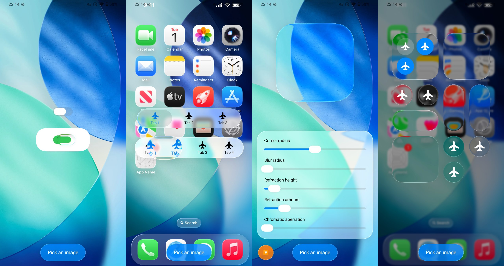
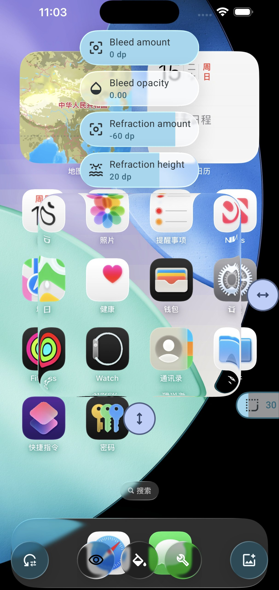

# Android Liquid Glass (Backdrop)

A customizable Liquid Glass effect library for Jetpack Compose.

## Docs

 

[Documentation](https://kyant.gitbook.io/backdrop)

## Components

The library does not include any high-level components; you will need to create your own.
Below are some example components:

- [LiquidButton](/catalog/src/main/java/com/kyant/backdrop/catalog/components/LiquidButton.kt)
- [LiquidToggle](/catalog/src/main/java/com/kyant/backdrop/catalog/components/LiquidToggle.kt)
- [LiquidSlider](/catalog/src/main/java/com/kyant/backdrop/catalog/components/LiquidSlider.kt)
- [LiquidBottomTabs](/catalog/src/main/java/com/kyant/backdrop/catalog/components/LiquidBottomTabs.kt)

## Demos

- [Backdrop Catalog](./catalog/release/catalog-release.apk)

- **(Deprecated)** [Liquid Glass Playground](./app/release/app-release.apk) (Android 13+)

